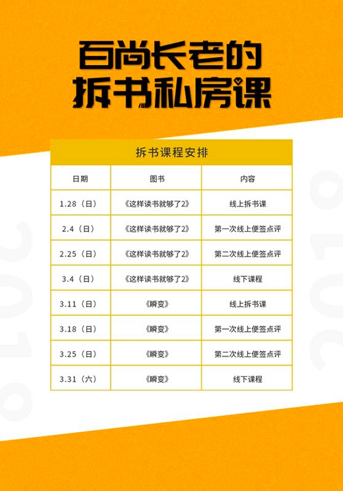

##2018年1月——《这样读书就够了 》

###便签一：什么是真正的成人学习？
<http://mp.weixin.qq.com/s/RT8QKDyIDL3_fLkY6GsPZA>
I：请用自己的话重述该段知识；
最近两年知识付费崛起，我们越来越容易获取到信息、获取到知识，甚至是最顶尖人士的前沿观点。于是我们付费、收藏、感动于他人的坚持，立志学习更多，于是付费学习各种音视频、去听大牛分享、购买成箱的书籍来武装自己，期待能获得快速的提升和成长，然而最终我们却发现，成长非常有限，掉进了文中所说的伪学习的深坑。那么成长的关键到底是什么呢？在于学习者自己，
1）是否有足够的学习能力，可以把知识用来解决问题，知行合一。
2）是否有自己的知识体系，可以举一反三，不断升级为专家。

A1：请联系实际，举例说明你过去一段时间的学习的经历。
过去是典型的伪学习患者，追逐干货、参加各种训练营、牛人分享，然而却很少与自己的实际生活相关，听完了也很少去思考这些东西对我的意义，是否对我产生了影响，总觉得多多益善，要把时间填满。周末去参加各种活动，朋友聚会，认为可以和牛人一起交流，没事在家逼着自己看书，时常看完了就忘了书中讲的大部分内容，偶尔难免失落和迷茫。

A2：请规划在未来的半年，结合本段的知识的启发，写出你的学习方法方面的行动计划。
未来半年，主要提升自己的学习能力和构建自己的知识体系
1）构建提问与解决问题知识体系：每周一本书，并分享和输出
2）每日反思，提升从经验中的学习能力

###便签二

